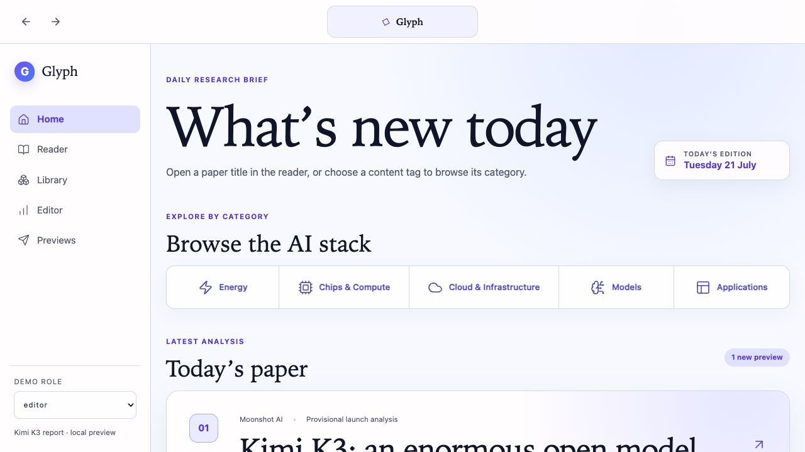

# Glyph

**Frontier AI research for investors, with the evidence left attached.**

Glyph is a paper-intelligence workspace that turns dense AI research into clear
technical mechanisms, source-linked claims, and carefully bounded market
context. It is designed for investors and technical decision-makers who need a
fast explanation without losing the path back to the original source.



## What Glyph does

Glyph follows an evidence-first editorial loop:

1. scan approved frontier-research sources;
2. classify and rank a small, explainable set of papers;
3. let an editor choose the paper worth covering;
4. extract claims, limitations, contradictions, and exact evidence spans;
5. explain the work at progressive levels of depth;
6. connect technical changes to sourced and timestamped market context;
7. run integrity checks and require editorial approval before publication;
8. learn from explicit reader feedback.

The central rule is simple: a material claim must link to known evidence, or it
must be marked as having insufficient evidence. Glyph is research tooling, not
investment advice, and it does not generate trade recommendations.

## Try the current version

### Requirements

- Node.js 22 or newer
- pnpm 11.9

### Run the web experience

```bash
pnpm install
pnpm dev
```

Open [http://127.0.0.1:4173](http://127.0.0.1:4173).

The shortest product tour is:

1. start on the animated landing page;
2. choose **Enter Glyph** to open the sign-in handoff;
3. sign in or choose **Explore the Glyph workspace** to open Discover;
4. open the selected paper, then move through Brief, Evidence, Concepts, and
   Market;
5. use Review to inspect publication blockers and Feedback to record reader
   preferences.

You can also open the worked example directly:

- Models: [http://127.0.0.1:4173/layers/models](http://127.0.0.1:4173/layers/models)
- Evidence Reader: [http://127.0.0.1:4173/reader/kimi-k3-open-frontier-intelligence](http://127.0.0.1:4173/reader/kimi-k3-open-frontier-intelligence)

The primary product workspace has eight views—Discover, Paper, Brief, Evidence,
Concepts, Market, Review, and Feedback—and begins at
`http://127.0.0.1:4173/#/discover`. These views deliberately use a clearly
labelled synthetic paper fixture. The separate Kimi K3 routes remain available
as a worked example using an attached first-party launch-blog printout and a
provisional Glyph analysis; that analysis has not been independently validated
and is not presented as Kimi's technical report.

### Build and verify

```bash
pnpm test:frontend
pnpm build
pnpm preview
```

`pnpm preview` serves the static production output at
[http://127.0.0.1:4173](http://127.0.0.1:4173).

## Product components

| Component | What it provides | Main location |
| --- | --- | --- |
| Landing and sign-in | Product story, interactive digest preview, and demo entry | `index.html`, `app.js`, `styles.css` |
| Models catalogue | Editorial labels, source boundaries, abstracts, and explainable scoring | `src/models-catalog.mjs`, `packages/recommendation` |
| Evidence Reader | Progressive analysis, claim selection, exact source pages, and evidence highlighting | `src/kimi-reader.mjs`, `fixtures/evidence`, `content/kimi-k3` |
| Research workspace | Discover-to-feedback prototype covering the complete editorial journey | `src/demo-content.mjs`, `src/routes.mjs` |
| API | Fastify REST/OpenAPI surface for sources, papers, workflows, reviews, and publication | `apps/api` |
| Worker | Idempotent asynchronous pipeline and daily source-scan entry point | `apps/worker` |
| Domain and application core | Evidence schemas, publication invariants, use cases, and provider-neutral ports | `packages/domain`, `packages/application` |
| Persistence | In-memory local adapter, PostgreSQL adapter, schema, and ordered migrations | `packages/database` |
| GPT-5.6 boundary | Structured Responses API transport, evidence drafter, and eight semantic agents | `packages/openai` |

The backend is a modular TypeScript monolith. Its dependency direction is
`api/worker -> application -> domain`; database and model providers sit behind
application interfaces so that editorial rules remain independent from a
specific vendor.

## Run the backend

For ephemeral local development, provide a long editor token and enable the
in-memory adapter:

```bash
export GLYPH_EDITOR_TOKEN="replace-with-a-long-random-secret"
export GLYPH_ALLOW_IN_MEMORY=true
pnpm dev:api
```

The API runs at [http://127.0.0.1:4000](http://127.0.0.1:4000), with OpenAPI
documentation at [http://127.0.0.1:4000/docs](http://127.0.0.1:4000/docs).
Editor mutations require both `Authorization: Bearer <GLYPH_EDITOR_TOKEN>` and
an `x-glyph-actor-id` header.

To use PostgreSQL, set `DATABASE_URL`, leave in-memory mode disabled, and run:

```bash
pnpm --filter @glyph/database migrate
pnpm dev:api
```

Run the complete repository verification with:

```bash
pnpm verify
```

## How Codex and GPT-5.6 were used

### Codex: product and engineering collaborator

Codex was used directly in the repository to translate the product brief into
the PRD and acceptance ledger, implement the responsive web experience and
evidence-first backend, define data and API contracts, add tests and validation,
and prepare the project documentation and submission workflow. It also helped
audit the repository against explicit completion gates instead of treating code
generation as proof that a feature was done.

Product positioning, source selection, editorial judgment, evidence approval,
and the final decision to publish remain human responsibilities. Generated code
and copy are expected to pass the same review and verification steps as any
other contribution.

### GPT-5.6: bounded semantic runtime

The running backend is designed to use `gpt-5.6-terra` through the OpenAI
Responses API for eight narrow semantic roles:

- paper classification;
- shortlist ranking;
- evidence extraction;
- paper summarization;
- concept mapping;
- market-context analysis;
- integrity review;
- editorial packaging.

There is also a focused evidence-drafting adapter. It receives a paper title,
an investor question, and pre-selected evidence spans; it returns a structured
summary, claims, limitations, and open questions.

The model does not receive publication authority or unrestricted source access.
Its output is constrained by strict JSON Schema, parsed again with Zod, and
checked against known paper versions, evidence IDs, pages, concepts, and market
records. Unknown citations, malformed support states, refusals, and unsupported
cross-record references fail closed. Responses are requested with `store:
false`, bounded retries, and explicit timeouts.

The automated tests use a mock transport and do not require a live credential.
To execute semantic agents, provide `OPENAI_API_KEY` at runtime and optionally
override `OPENAI_MODEL`. Live workflow execution also requires an
editor-approved label ontology and real source inputs. No API key belongs in
the repository.

## Current scope

This repository contains a polished frontend worked example and an implemented,
tested backend foundation; they are not yet a production end-to-end service.
Production connectors, a real PDF extraction pipeline, approved source and
rights policies, gold evaluation sets, market-data adapters, hosted workers,
and final identity infrastructure remain future work. The evidence and
publication boundaries are implemented now so those integrations can be added
without weakening the core trust model.

## Documentation

- [Product requirements](docs/PRD.md)
- [Project status](docs/PROJECT_STATUS.md)
- [Backend architecture](docs/BACKEND_ARCHITECTURE.md)
- [Runtime agent system](docs/RUNTIME_AGENTS.md)
- [OpenAI integration boundary](docs/OPENAI_INTEGRATION.md)
- [Paper and evidence handoff](docs/PAPER_HANDOFF.md)
- [Submission package](submission/README.md)
