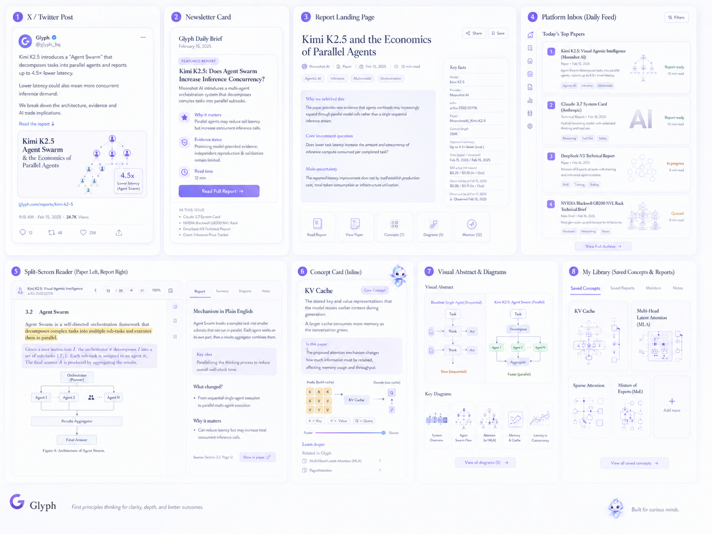
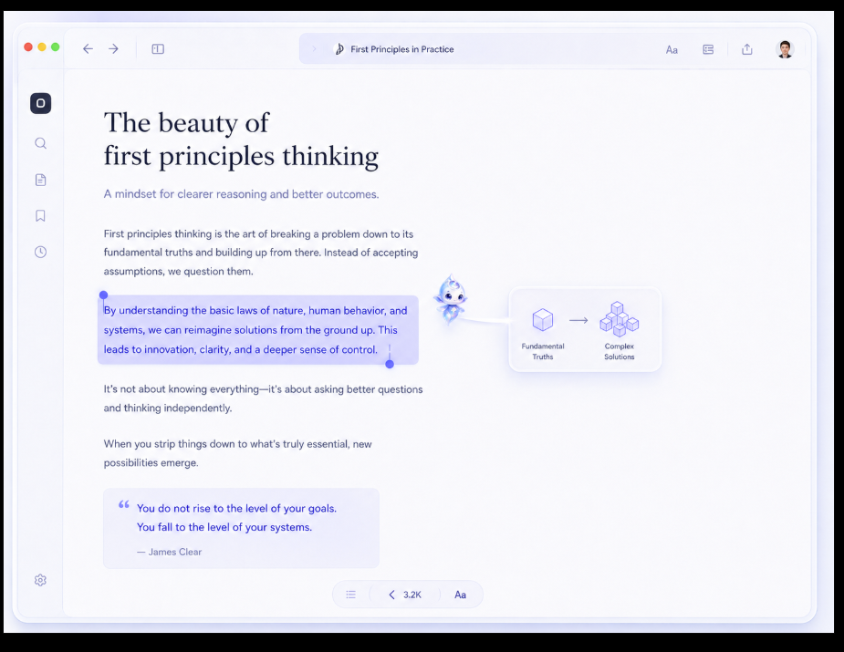

# Glyph Paper Analyser Platform — V1 PRD

## 1. Product definition

### Product thesis

Glyph helps finance-native AI investors understand frontier AI papers simply
and visually, evaluate whether their claims are credible, and identify
defensible implications for the AI market.

### Primary user

A public-market or crossover investor, analyst, VC, or bottleneck bro who
understands business arguments but cannot reliably unpack frontier architecture
papers.

### Core promise

Glyph turns the most important frontier AI paper of the day into a visual,
understandable, source-linked learning experience—without removing the technical
rigor needed to judge it.

### Product principles

- Understanding comes before investment implications.
- Use progressive depth: simple explanation first, technical detail on demand.
- Every difficult concept receives a short contextual definition.
- Diagrams build mental models, not decorative summaries.
- Facts, Glyph calculations, and Glyph interpretations remain distinct.
- "No direct trade implication" is a valid conclusion.

### V1 operating model

- Scan approved labs, authors, repositories, and research feeds.
- Rank three to four candidates each weekday.
- A human editor selects one paper.
- Generate the report, concept cards, diagrams, newsletter, and X package.
- A human editor approves the complete edition.

Launch with:

- 50–100 human-labelled papers.
- 25 complete reports.
- 50 invited beta users.

## 2. User experience

### Acquisition flow

```text
Newsletter/X -> public featured report -> visual split-screen reader
-> paid archive and learning tools
```

The featured report remains public for seven days. Paid users receive the
archive, personalization, cited Q&A, saved concepts, and visual exports.

### Platform inbox

Each paper card shows:

- Title, authors, lab, and publication date.
- One-sentence plain-English claim.
- Concepts taught.
- Topic and mechanism labels.
- Technical difficulty.
- Why Glyph selected it.
- Report status and reading time.

### Split-screen reader

Desktop:

- Left: paper PDF with highlighted source passages.
- Right: progressive visual explanation and report.

Selecting a quote, claim, or citation:

- Scrolls the PDF to the exact page.
- Highlights the supporting passage.
- Briefly emphasizes the connection.
- Provides the source section and page number.

Mobile:

- The report appears first.
- "Open evidence" reveals the corresponding highlighted PDF passage.

### Progressive explanation system

The right-hand report has three levels.

#### Understand in five minutes

- Plain-English claim.
- One central mental-model diagram.
- Short explanation of what changed.
- Why the change matters.
- Five essential definitions.

#### Understand the mechanism

- Step-by-step visual explanation.
- Baseline-versus-new-method comparison.
- Concept cards and analogies.
- Important benchmark results.

#### Examine the evidence

- Architecture details.
- Equations and implementation notes.
- Benchmark methodology.
- Limitations, counterarguments, and source passages.

Technical detail is collapsed by default but remains available without leaving
the report.

### Inline concept cards

Technical terms are highlighted inside the report. Selecting one opens a compact
card containing:

- One-sentence definition.
- Two-to-three-sentence contextual explanation.
- Why the concept matters in this paper.
- Small diagram or analogy when useful.
- "Learn deeper" link.
- Related papers already in Glyph.

Example:

> **KV cache:** The stored key and value representations that let a model reuse
> earlier context during generation. A larger cache consumes more memory as the
> conversation grows. In this paper, the proposed attention mechanism changes
> how much information must be retained.

Saved concept cards enter the user's learning library.

### Visual direction

The supplied references are the canonical starting point for V1 visual design:





The interface should feel like a calm editorial reading tool rather than a
dense trading terminal:

- Serif display typography with clear, readable sans-serif supporting text.
- White and very pale cool surfaces with restrained violet-blue accents.
- Generous whitespace, subtle borders and shadows, rounded cards, and sparse
  navigation chrome.
- Compact technical diagrams integrated with the reading flow.
- Selection and evidence states that are visible without overwhelming the page.
- The Glyph character may add warmth and guidance but must not compete with
  evidence or technical content.
- Information hierarchy, clarity, and accessibility take priority over literal
  pixel imitation of a reference image.

## 3. Report and visual requirements

### Required report structure

#### Paper in one sentence

What the authors changed and why it matters.

#### Visual abstract

- Central mental model.
- Baseline on one side and proposed mechanism on the other.
- Information movement, stored state, and changed component.

#### Executive summary

- What the paper claims.
- Who produced it and why now.
- What is genuinely new.
- Strongest evidence.
- Largest uncertainty.

#### Background and current landscape

- Concepts needed to understand the work.
- Relevant architectural history.
- Current competing approaches.
- How this paper changes the landscape.
- Background chart or timeline when useful.

#### Mechanism in plain English

- Step-by-step explanation.
- Simple analogy where accurate.
- Comparison with the relevant baseline.
- Training, prefill, and decoding kept distinct.

#### Technical evidence

- Benchmarks, units, denominators, hardware, and model versions.
- Paper claims separated from Glyph calculations.
- Missing experiments and contradictory evidence.
- Expandable architecture and equation details.

#### Why this matters for the AI frontier

- Capability, efficiency, scaling, deployment, and competitive implications.
- Demonstrated results separated from possible future effects.

#### Why this matters for the AI trade

Conditional synthesis of implications for:

- AI supply-chain layers.
- Cost and performance bottlenecks.
- Relevant sectors or companies.
- Competitive positioning.
- Adoption timing.

Include only defensible connections. Allow "no direct trade implication."

#### What to watch next

Evidence that would validate or disprove Glyph's interpretation.

#### Concepts and sources

- Concepts taught.
- Canonical paper.
- Background sources.
- Timestamped market sources.

### Diagram system

Every report includes:

- One hero mental-model infographic.
- Two to four focused concept diagrams.
- At least one baseline comparison.
- Small diagrams inside selected concept cards.

Diagrams should answer:

- What information enters?
- What is stored or discarded?
- What component changes?
- How is the new method different?
- What capability or cost variable could change?

Show the background and context of the innovation. If the paper mentions KDA or
Sparse Attention, at least one image should contain MLA.

Analytical diagrams originate from a structured visual specification containing
exact labels, relationships, units, claims, and citations. Technical diagrams
are rendered deterministically as SVG. Image generation may provide
non-semantic illustration or styling, but it cannot determine factual labels,
arrows, or numerical relationships.

### Market-context policy

Elo-style scores, OpenRouter activity, API pricing, and input/output costs appear
only when they help evaluate the paper.

Every metric must contain:

- Source and retrieval date.
- Model version.
- Value and unit.
- Provider, hardware, context length, or benchmark conditions.
- Explanation of relevance.
- Comparison limitations.

Glyph must not compare metrics with mismatched versions, periods, or
denominators.

## 4. Discovery and system requirements

### Recommendation seed set

Human editors label 50–100 relevant papers from the preceding six months by:

- Topic and subfield.
- Lab, authors, and repository.
- Technical mechanism.
- Training, prefill, decoding, or application relevance.
- Capability or economic variable affected.
- Research maturity.
- Evidence quality.
- Novelty.
- Investor relevance.
- Difficulty.
- Related and competing work.

V1 uses retrieval and ranking rather than model fine-tuning.

### Daily discovery pipeline — TBD

- Poll approved feeds, APIs, repositories, labs, and authors.
- Normalize metadata and deduplicate versions.
- Exclude inaccessible or irrelevant papers.
- Retrieve similar examples from the labelled corpus.
- Rank using:
  - Audience relevance: 30%.
  - Frontier importance: 25%.
  - Novelty: 20%.
  - Evidence quality: 15%.
  - Timeliness: 10%.
- Present the top three to four candidates with selection rationales.
- A human editor selects one.

### Paper storage

For public papers, store:

- Original PDF and canonical URL.
- Version, checksum, and licence status.
- Text and section structure by page.
- Figures and tables.
- Passage bounding boxes.
- Citation graph.
- Publication and revision dates.

Restricted papers remain external links.

### Processing workflow

```text
discover -> classify -> rank -> select -> parse -> extract evidence
-> generate teaching outline -> generate report -> generate visuals
-> automated QA -> editor approval -> publish -> distribute
```

A report cannot publish when:

- A material claim lacks evidence.
- Page-level source mapping fails.
- A definition is misleading in the paper's context.
- A diagram contradicts the paper or report.
- Market data lacks a timestamp or denominator.
- Facts and Glyph interpretation cannot be distinguished.

### Core records

- Paper
- PaperVersion
- EvidenceSpan
- Claim
- Report
- ReportSection
- Concept
- ConceptCard
- VisualSpec
- MarketMetric
- UserProfile
- SavedConcept
- QuestionAnswer

### Reference implementation

- Next.js and TypeScript.
- Managed PostgreSQL with vector search.
- Object storage for permitted PDFs and assets.
- Background processing for discovery, parsing, generation, and QA.
- PDF.js-compatible reader.
- Transactional email service.
- Stripe subscriptions.
- Invite-only beta authentication.
- OpenAI's Responses API with structured outputs for evidence extraction,
  definitions, report specifications, critique, and cited Q&A.
- Configurable model routing for classification, deep synthesis, and visual
  generation.
- GPT Image 2 may create non-semantic illustration; exact analytical diagrams
  remain SVG-based.

## 5. Distribution, tests, and boundaries

### Newsletter

One paper and exactly five bullets:

1. The claim.
2. Who produced it and why now.
3. The mechanism in plain English.
4. Why it matters for the AI frontier.
5. Investor relevance—or no direct implication—and concepts taught.

### X package

- One hook.
- Hero mental-model visual.
- Three observations.
- Canonical paper link.
- Glyph report link.
- Speculation disclaimer when needed.

### Acceptance tests

- A non-technical investor can identify the paper's claim after the five-minute
  layer.
- The reader can expand technical depth without losing their place.
- Every unfamiliar term has a contextual concept card.
- Selecting a citation opens the exact highlighted PDF passage.
- A Kimi report distinguishes K2/K2.5 from separate Kimi Linear/KDA and MoBA
  work.
- Complexity claims specify training, prefill, per-token decoding, or cumulative
  generation.
- Diagrams correctly show information movement, storage, and changed components.
- Market data is omitted when irrelevant.
- Company implications appear only when defensible.
- Q&A returns `INSUFFICIENT_EVIDENCE` when necessary.
- Newsletter output follows the five-bullet contract.

### Non-goals

- Browser extension.
- Multiple complete reports per day.
- Automatic publication.
- Buy/sell recommendations or price targets.
- Paywalled-content scraping.
- Unrestricted research chat.
- Model fine-tuning in V1.
- Forced company implications.
- Simplification that materially changes the paper's claim.

### Assumptions

- Berat is the initial editor.
- One global paper is published each weekday.
- Featured reports remain public for seven days.
- Understanding the technical mechanism precedes the investor narrative.
- Diagrams optimize first for mental-model formation.
- Technical detail remains available through progressive expansion.
- The split-screen learning experience is the core product; newsletter and X
  are distribution.
